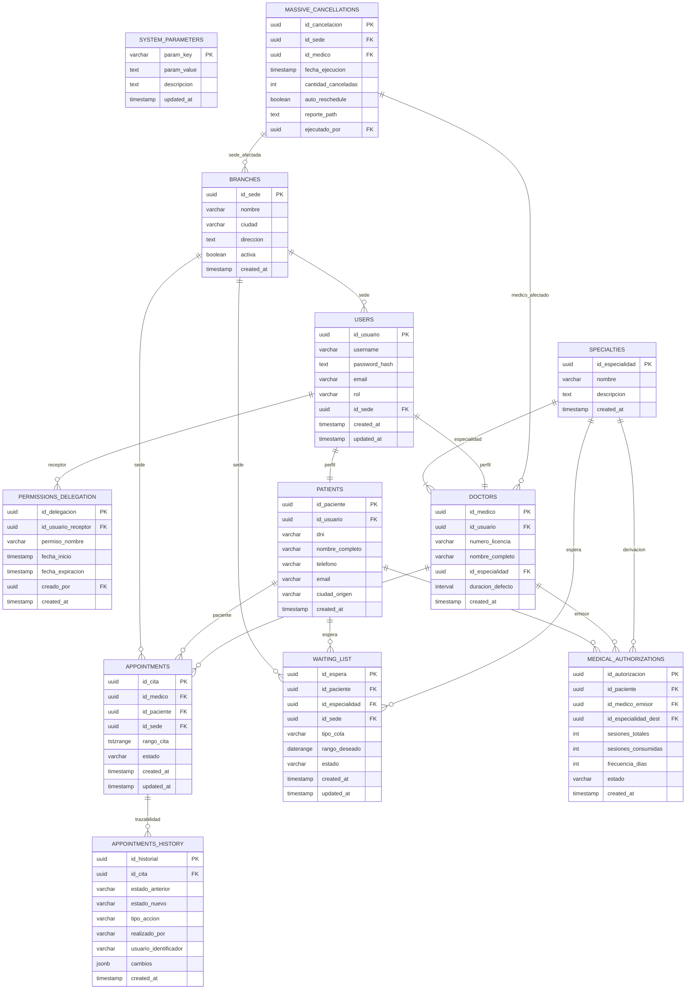

# 🗄️ Capítulo 1: Diseño de Base de Datos (PostgreSQL Nativo)

**ID del Documento:** `DOC-01`  
**Estado:** `APPROVED`  
**Mantenedor:** Equipo de Ingeniería de Datos / DBA  
**Presupuesto de Rendimiento:** Latencia de consulta `p95 < 100ms` para operaciones CRUD.

---

## 1. Introducción y Elección del Motor

Para el **Sistema de Gestión de Citas Médicas (SGCM)** en producción, la persistencia se delega a **PostgreSQL (v15+)**. A diferencia de otros motores, PostgreSQL ofrece:
1. **Multi-Version Concurrency Control (MVCC) avanzado:** Permite lecturas no bloqueantes y excelente gestión de transacciones simultáneas sin bloqueos de tabla.
2. **Tipos de datos de Rango Temporal (`tstzrange` y `daterange`):** Permite modelar citas médicas y rangos deseados de lista de espera como intervalos continuos nativos, facilitando cálculos de intersección `@>` y solapamiento `&&` en SQL.
3. **Restricción de Exclusión (Exclusion Constraints):** Garantiza a nivel de motor físico que **ningún médico sea agendado dos veces en el mismo bloque de tiempo**.
4. **Soporte robusto multi-sede nacional:** Integra soporte relacional para sedes, cuentas centralizadas con RBAC y auditoría transaccional inmutable.

---

## 2. Diagrama de la Arquitectura de Base de Datos (DER)

El siguiente Diagrama Entidad-Relación (DER) ilustra el modelado lógico físico de la persistencia de datos, las relaciones y la cardinalidad de la base de datos robustecida:



---

## 3. Esquema Físico DDL (PostgreSQL Unificado)

El siguiente script de inicialización modela de forma determinista la estructura relacional e integra las exclusiones. Se requiere la extensión `btree_gist` para mezclar campos `UUID` con rangos de tiempo.

```sql
-- Habilitar extensiones necesarias
CREATE EXTENSION IF NOT EXISTS "uuid-ossp";
CREATE EXTENSION IF NOT EXISTS "btree_gist";

-- 1. Tabla de Especialidades Médicas
CREATE TABLE specialties (
    id_especialidad UUID PRIMARY KEY DEFAULT uuid_generate_v4(),
    nombre VARCHAR(100) NOT NULL UNIQUE,
    descripcion TEXT,
    created_at TIMESTAMP WITH TIME ZONE DEFAULT CURRENT_TIMESTAMP
);

-- 2. Tabla de Sedes (Multi-sede nacional)
CREATE TABLE branches (
    id_sede UUID PRIMARY KEY DEFAULT uuid_generate_v4(),
    nombre VARCHAR(150) NOT NULL UNIQUE,
    ciudad VARCHAR(100) NOT NULL,
    direccion TEXT NOT NULL,
    activa BOOLEAN DEFAULT TRUE,
    created_at TIMESTAMP WITH TIME ZONE DEFAULT CURRENT_TIMESTAMP
);

-- 3. Tabla de Usuarios (Autenticación y Seguridad Centralizada)
CREATE TABLE users (
    id_usuario UUID PRIMARY KEY DEFAULT uuid_generate_v4(),
    username VARCHAR(50) UNIQUE NOT NULL,
    password_hash TEXT NOT NULL,
    email VARCHAR(150) UNIQUE NOT NULL,
    rol VARCHAR(30) NOT NULL CHECK (rol IN ('Admin', 'Recepcionista', 'Medico', 'Paciente')),
    id_sede UUID REFERENCES branches(id_sede) ON UPDATE CASCADE ON DELETE SET NULL,
    created_at TIMESTAMP WITH TIME ZONE DEFAULT CURRENT_TIMESTAMP,
    updated_at TIMESTAMP WITH TIME ZONE DEFAULT CURRENT_TIMESTAMP
);

-- 4. Parámetros Globales del Sistema (Configuración en Caliente)
CREATE TABLE system_parameters (
    param_key VARCHAR(50) PRIMARY KEY,
    param_value TEXT NOT NULL,
    descripcion TEXT,
    updated_at TIMESTAMP WITH TIME ZONE DEFAULT CURRENT_TIMESTAMP
);

-- 5. Delegación de Permisos Dinámicos y Temporales
CREATE TABLE permissions_delegation (
    id_delegacion UUID PRIMARY KEY DEFAULT uuid_generate_v4(),
    id_usuario_receptor UUID NOT NULL REFERENCES users(id_usuario) ON DELETE CASCADE,
    permiso_nombre VARCHAR(100) NOT NULL,
    fecha_inicio TIMESTAMP WITH TIME ZONE NOT NULL,
    fecha_expiracion TIMESTAMP WITH TIME ZONE,
    creado_por UUID REFERENCES users(id_usuario) ON DELETE SET NULL,
    created_at TIMESTAMP WITH TIME ZONE DEFAULT CURRENT_TIMESTAMP
);

-- 6. Tabla de Pacientes (Dominio Clínico)
CREATE TABLE patients (
    id_paciente UUID PRIMARY KEY DEFAULT uuid_generate_v4(),
    id_usuario UUID UNIQUE REFERENCES users(id_usuario) ON DELETE SET NULL,
    dni VARCHAR(20) NOT NULL UNIQUE,
    nombre_completo VARCHAR(150) NOT NULL,
    telefono VARCHAR(20) NOT NULL,
    email VARCHAR(150) NOT NULL UNIQUE,
    ciudad_origen VARCHAR(100) NOT NULL,
    created_at TIMESTAMP WITH TIME ZONE DEFAULT CURRENT_TIMESTAMP
);

-- 7. Tabla de Médicos (Dominio Clínico)
CREATE TABLE doctors (
    id_medico UUID PRIMARY KEY DEFAULT uuid_generate_v4(),
    id_usuario UUID UNIQUE REFERENCES users(id_usuario) ON DELETE SET NULL,
    numero_licencia VARCHAR(50) NOT NULL UNIQUE,
    nombre_completo VARCHAR(150) NOT NULL,
    id_especialidad UUID NOT NULL REFERENCES specialties(id_especialidad) ON DELETE RESTRICT,
    duracion_defecto INTERVAL NOT NULL DEFAULT '30 minutes',
    created_at TIMESTAMP WITH TIME ZONE DEFAULT CURRENT_TIMESTAMP
);

-- 8. Tabla de Citas Médicas con Restricciones Multisede
CREATE TABLE appointments (
    id_cita UUID PRIMARY KEY DEFAULT uuid_generate_v4(),
    id_medico UUID NOT NULL REFERENCES doctors(id_medico) ON DELETE CASCADE,
    id_paciente UUID REFERENCES patients(id_paciente) ON DELETE SET NULL,
    id_sede UUID NOT NULL REFERENCES branches(id_sede) ON DELETE CASCADE,
    rango_cita TSTZRANGE NOT NULL,
    estado VARCHAR(50) NOT NULL DEFAULT 'Agendada' 
        CONSTRAINT chk_estado CHECK (estado IN ('Agendada', 'Confirmada', 'EnCurso', 'Finalizada', 'Cancelada', 'NoAsistio')),
    created_at TIMESTAMP WITH TIME ZONE DEFAULT CURRENT_TIMESTAMP,
    updated_at TIMESTAMP WITH TIME ZONE DEFAULT CURRENT_TIMESTAMP,

    -- RESTRICCIÓN DE EXCLUSIÓN: Cero cruces para el mismo médico
    CONSTRAINT exclude_overlapping_appointments EXCLUDE USING gist (
        id_medico WITH =,
        rango_cita WITH &&
    )
);

-- 9. Tabla de Lista de Espera Inteligente (LEA)
CREATE TABLE waiting_list (
    id_espera UUID PRIMARY KEY DEFAULT uuid_generate_v4(),
    id_paciente UUID NOT NULL REFERENCES patients(id_paciente) ON DELETE CASCADE,
    id_especialidad UUID NOT NULL REFERENCES specialties(id_especialidad) ON DELETE CASCADE,
    id_sede UUID NOT NULL REFERENCES branches(id_sede) ON DELETE CASCADE,
    tipo_cola VARCHAR(30) NOT NULL DEFAULT 'FechaCercana'
        CONSTRAINT chk_tipo_cola CHECK (tipo_cola IN ('FechaCercana', 'RangoEspecifico')),
    rango_deseado DATERANGE,
    estado VARCHAR(30) NOT NULL DEFAULT 'Pendiente'
        CONSTRAINT chk_estado_espera CHECK (estado IN ('Pendiente', 'Asignada', 'Cancelada', 'Expirada')),
    created_at TIMESTAMP WITH TIME ZONE DEFAULT CURRENT_TIMESTAMP,
    updated_at TIMESTAMP WITH TIME ZONE DEFAULT CURRENT_TIMESTAMP
);

-- 10. Tabla de Historial y Auditoría Transaccional de Citas (Inmutable)
CREATE TABLE appointments_history (
    id_historial UUID PRIMARY KEY DEFAULT uuid_generate_v4(),
    id_cita UUID NOT NULL REFERENCES appointments(id_cita) ON DELETE CASCADE,
    estado_anterior VARCHAR(20) CHECK (estado_anterior IN ('Agendada', 'Confirmada', 'EnCurso', 'Finalizada', 'Cancelada', 'NoAsistio')),
    estado_nuevo VARCHAR(20) NOT NULL CHECK (estado_nuevo IN ('Agendada', 'Confirmada', 'EnCurso', 'Finalizada', 'Cancelada', 'NoAsistio')),
    tipo_accion VARCHAR(20) NOT NULL CHECK (tipo_accion IN ('Creacion', 'Asignacion', 'Modificacion', 'Cancelacion')),
    realizado_por VARCHAR(20) NOT NULL CHECK (realizado_por IN ('Paciente', 'Recepcionista', 'Medico', 'Sistema')),
    usuario_identificador VARCHAR(150) NOT NULL,
    cambios JSONB DEFAULT '{}'::jsonb,
    created_at TIMESTAMP WITH TIME ZONE DEFAULT CURRENT_TIMESTAMP
);

-- 11. Autorizaciones Médicas (Derivaciones recurrentes)
CREATE TABLE medical_authorizations (
    id_autorizacion UUID PRIMARY KEY DEFAULT uuid_generate_v4(),
    id_paciente UUID NOT NULL REFERENCES patients(id_paciente) ON DELETE CASCADE,
    id_medico_emisor UUID NOT NULL REFERENCES doctors(id_medico) ON DELETE CASCADE,
    id_especialidad_dest UUID NOT NULL REFERENCES specialties(id_especialidad) ON DELETE CASCADE,
    sesiones_totales INT NOT NULL CHECK (sesiones_totales > 0),
    sesiones_consumidas INT DEFAULT 0 CHECK (sesiones_consumidas >= 0),
    frecuencia_dias INT NOT NULL CHECK (frecuencia_dias > 0),
    estado VARCHAR(20) DEFAULT 'Activa' CHECK (estado IN ('Activa', 'Consumida', 'Cancelada')),
    created_at TIMESTAMP WITH TIME ZONE DEFAULT CURRENT_TIMESTAMP
);

-- 12. Tabla de Auditoría de Cancelaciones Masivas
CREATE TABLE massive_cancellations (
    id_cancelacion UUID PRIMARY KEY DEFAULT uuid_generate_v4(),
    id_sede UUID REFERENCES branches(id_sede) ON DELETE SET NULL,
    id_medico UUID REFERENCES doctors(id_medico) ON DELETE SET NULL,
    fecha_ejecucion TIMESTAMP WITH TIME ZONE DEFAULT CURRENT_TIMESTAMP,
    cantidad_canceladas INT DEFAULT 0,
    auto_reschedule BOOLEAN DEFAULT TRUE,
    reporte_path TEXT,
    ejecutado_por UUID REFERENCES users(id_usuario) ON DELETE SET NULL
);
```

---

## 4. Optimización del Rendimiento en Producción

### 4.1. Índices GIST para Intervalos Temporales (Concurrencia)
Los índices GIST permiten a PostgreSQL optimizar búsquedas y restricciones espaciales/temporales (como el solapamiento de intervalos `&&`).

```sql
-- Índice GIST completo sobre el rango de la cita
CREATE INDEX IF NOT EXISTS idx_active_appointments ON appointments USING GIST (rango_cita);
```

### 4.2. Configuración Agresiva de Autovacuum
La inserción y eliminación constante de citas médicas produce fragmentación rápida y tuplas muertas en la base de datos (Bloat). Para evitar la degradación del rendimiento, la tabla `appointments` se configurará con un ciclo de autovacuum altamente receptivo:

```sql
ALTER TABLE appointments SET (
    autovacuum_vacuum_scale_factor = 0.05,  -- Activa vacuum cuando se altera el 5% de las filas
    autovacuum_analyze_scale_factor = 0.02, -- Recalcula estadísticas al alterar el 2%
    autovacuum_vacuum_cost_limit = 1000     -- Asigna más prioridad y recursos al autovacuum
);
```

### 4.3. Índices de Alto Rendimiento para Historial y Auditoría
Para mitigar el impacto de crecimiento exponencial de la tabla `appointments_history`, se implementan los siguientes índices B-Tree específicos:

```sql
-- Índice compuesto: Obtención del historial de una cita sin ordenar en memoria
CREATE INDEX IF NOT EXISTS idx_history_cita_fecha ON appointments_history(id_cita, created_at DESC);

-- Índice en pacientes para login y búsquedas de DNI
CREATE INDEX IF NOT EXISTS idx_patients_dni ON patients(dni);

-- Índice en usuarios para búsquedas rápidas de login
CREATE INDEX IF NOT EXISTS idx_users_username ON users(username);

-- Índice parcial en lista de espera para procesar únicamente registros activos
CREATE INDEX IF NOT EXISTS idx_waiting_list_status ON waiting_list(estado) WHERE estado = 'Pendiente';
```
