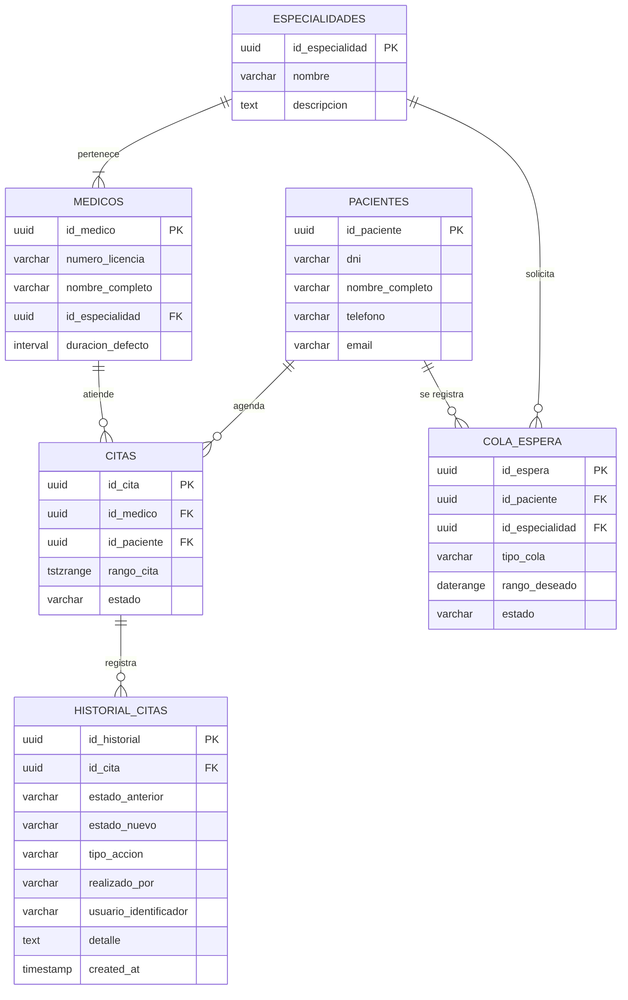

# 🗄️ Capítulo 1: Diseño de Base de Datos (PostgreSQL Nativo)

**ID del Documento:** `DOC-01`  
**Estado:** `APPROVED`  
**Mantenedor:** Equipo de Ingeniería de Datos / DBA  
**Presupuesto de Rendimiento:** Latencia de consulta `p95 < 100ms` para operaciones CRUD.

---

## 1. Introducción y Elección del Motor

Para el **Sistema de Gestión de Citas Médicas (SGCM)** en producción, la persistencia se delega a **PostgreSQL (v15+)**. A diferencia de MySQL, PostgreSQL ofrece:
1. **Multi-Version Concurrency Control (MVCC) avanzado:** Permite lecturas no bloqueantes y excelente gestión de transacciones simultáneas.
2. **Tipos de datos de Rango Temporal (`tstzrange`):** Permite modelar citas médicas como un intervalo continuo con zona horaria (UTC), facilitando cálculos de intersección en lugar de complejas e inestables validaciones a nivel de aplicación.
3. **Restricción de Exclusión (Exclusion Constraints):** Garantiza a nivel de motor de base de datos que **ningún médico sea agendado dos veces en el mismo bloque horario**.

---

## 2. Diagrama de la Arquitectura de Base de Datos (DER)

El siguiente Diagrama Entidad-Relación (DER) ilustra el modelado lógico de la persistencia de datos, las relaciones y la cardinalidad entre los componentes del sistema clínico, la lista de espera y los logs transaccionales inmutables:



---

## 3. Esquema Físico DDL (PostgreSQL)

El siguiente script de inicialización crea la estructura relacional e inyecta las restricciones de exclusión. Se requiere la extensión `btree_gist` para poder mezclar tipos primitivos como `UUID` con tipos de rango en el índice GIST.

Incluye la tabla robustecida de **Historial de Citas (`appointments_history`)** para registrar cada cambio de estado, quién lo realizó (Paciente, Médico, Recepcionista, o automáticamente el Sistema) y qué campos fueron modificados para auditoría inmutable.

```sql
-- Habilitar extensiones necesarias
CREATE EXTENSION IF NOT EXISTS "uuid-ossp";
CREATE EXTENSION IF NOT EXISTS "btree_gist";

-- 1. Tabla de Especialidades Médicas
CREATE TABLE specialties (
    id_especialidad UUID PRIMARY KEY DEFAULT uuid_generate_v4(),
    nombre VARCHAR(100) NOT NULL UNIQUE,
    descripcion TEXT,
    created_at TIMESTAMP WITH TIME ZONE DEFAULT CURRENT_TIMESTAMP
);

-- 2. Tabla de Médicos
CREATE TABLE doctors (
    id_medico UUID PRIMARY KEY DEFAULT uuid_generate_v4(),
    numero_licencia VARCHAR(50) NOT NULL UNIQUE,
    nombre_completo VARCHAR(150) NOT NULL,
    id_especialidad UUID NOT NULL REFERENCES specialties(id_especialidad) ON DELETE RESTRICT,
    duracion_defecto INTERVAL NOT NULL DEFAULT '30 minutes', -- Duración parametrizable por médico
    created_at TIMESTAMP WITH TIME ZONE DEFAULT CURRENT_TIMESTAMP
);

-- 3. Tabla de Pacientes
CREATE TABLE patients (
    id_paciente UUID PRIMARY KEY DEFAULT uuid_generate_v4(),
    dni VARCHAR(20) NOT NULL UNIQUE,
    nombre_completo VARCHAR(150) NOT NULL,
    telefono VARCHAR(20) NOT NULL,
    email VARCHAR(150) NOT NULL UNIQUE,
    created_at TIMESTAMP WITH TIME ZONE DEFAULT CURRENT_TIMESTAMP
);

-- 4. Tabla de Citas Médicas con Restricción de Solapamiento
CREATE TABLE appointments (
    id_cita UUID PRIMARY KEY DEFAULT uuid_generate_v4(),
    id_medico UUID NOT NULL REFERENCES doctors(id_medico) ON DELETE CASCADE,
    id_paciente UUID REFERENCES patients(id_paciente) ON DELETE SET NULL,
    -- Rango de tiempo de la cita (UTC con Zona Horaria)
    rango_cita TSTZRANGE NOT NULL,
    estado VARCHAR(50) NOT NULL DEFAULT 'Agendada' 
        CONSTRAINT chk_estado CHECK (estado IN ('Agendada', 'Confirmada', 'EnCurso', 'Finalizada', 'Cancelada', 'NoAsistio')),
    created_at TIMESTAMP WITH TIME ZONE DEFAULT CURRENT_TIMESTAMP,
    updated_at TIMESTAMP WITH TIME ZONE DEFAULT CURRENT_TIMESTAMP,

    -- RESTRICCIÓN DE EXCLUSIÓN: Ningún médico puede tener citas solapadas (&&)
    -- El operador '=' asegura que sea para el mismo médico, y '&&' verifica el cruce de rangos
    CONSTRAINT exclude_overlapping_appointments EXCLUDE USING gist (
        id_medico WITH =,
        rango_cita WITH &&
    )
);

-- 5. Tabla de Solicitudes en Lista de Espera (LEA)
CREATE TABLE waiting_list (
    id_espera UUID PRIMARY KEY DEFAULT uuid_generate_v4(),
    id_paciente UUID NOT NULL REFERENCES patients(id_paciente) ON DELETE CASCADE,
    id_especialidad UUID NOT NULL REFERENCES specialties(id_especialidad) ON DELETE CASCADE,
    tipo_cola VARCHAR(30) NOT NULL DEFAULT 'FechaCercana'
        CONSTRAINT chk_tipo_cola CHECK (tipo_cola IN ('FechaCercana', 'RangoEspecifico')),
    rango_deseado DATERANGE, -- Rango de fechas estimado (solo aplica para RangoEspecifico)
    estado VARCHAR(30) NOT NULL DEFAULT 'Pendiente'
        CONSTRAINT chk_estado_espera CHECK (estado IN ('Pendiente', 'Asignada', 'Cancelada', 'Expirada')),
    created_at TIMESTAMP WITH TIME ZONE DEFAULT CURRENT_TIMESTAMP,
    updated_at TIMESTAMP WITH TIME ZONE DEFAULT CURRENT_TIMESTAMP
);

-- 6. Tabla de Historial y Auditoría Transaccional de Citas (Inmutable)
CREATE TABLE appointments_history (
    id_historial UUID PRIMARY KEY DEFAULT uuid_generate_v4(),
    id_cita UUID NOT NULL REFERENCES appointments(id_cita) ON DELETE CASCADE,
    estado_anterior VARCHAR(20) CHECK (estado_anterior IN ('Agendada', 'Confirmada', 'EnCurso', 'Finalizada', 'Cancelada', 'NoAsistio')),
    estado_nuevo VARCHAR(20) NOT NULL CHECK (estado_nuevo IN ('Agendada', 'Confirmada', 'EnCurso', 'Finalizada', 'Cancelada', 'NoAsistio')),
    tipo_accion VARCHAR(20) NOT NULL CHECK (tipo_accion IN ('Creacion', 'Asignacion', 'Modificacion', 'Cancelacion')),
    realizado_por VARCHAR(20) NOT NULL CHECK (realizado_por IN ('Paciente', 'Recepcionista', 'Medico', 'Sistema')),
    usuario_identificador VARCHAR(150) NOT NULL, -- Email o DNI de quien ejecuta, o 'SYSTEM'
    cambios JSONB DEFAULT '{}'::jsonb, -- Diferencial de cambios (ej: {"rango_cita": {"old": "[start, end]", "new": "[start, end]"}})
    created_at TIMESTAMP WITH TIME ZONE DEFAULT CURRENT_TIMESTAMP
);
```

---

## 4. Optimización del Rendimiento en Producción

### 4.1. Índices GIST para Intervalos Temporales (Concurrencia)
Los índices GIST permiten a PostgreSQL optimizar de forma asombrosa las búsquedas y restricciones espaciales/temporales (como el solapamiento de intervalos `&&`). 

> [!NOTE]
> **Nota de Diseño Físico (Zonas Horarias e Inmutabilidad):**
> En PostgreSQL, los predicados de índices parciales (la cláusula `WHERE`) exigen el uso de funciones estrictamente **inmutables** (deterministas). Funciones dinámicas como `NOW()` o `CURRENT_TIMESTAMP` son clasificadas como **volátiles** porque cambian en cada ejecución, por lo cual no se permiten en índices parciales para evitar inconsistencias físicas en disco. En consecuencia, implementamos el índice GIST completo sobre el rango:

```sql
-- Índice GIST completo sobre el rango de la cita
CREATE INDEX IF NOT EXISTS idx_active_appointments ON appointments USING GIST (rango_cita);
```

### 4.2. Configuración Agresiva de Autovacuum
El agendamiento y liberación constante de citas médicas produce fragmentación rápida y tuplas muertas en la base de datos (Bloat). Para evitar la degradación del rendimiento, la tabla `appointments` se configurará con un ciclo de autovacuum altamente receptivo:

```sql
ALTER TABLE appointments SET (
    autovacuum_vacuum_scale_factor = 0.05,  -- Activa vacuum cuando se altera el 5% de las filas
    autovacuum_analyze_scale_factor = 0.02, -- Recalcula estadísticas al alterar el 2%
    autovacuum_vacuum_cost_limit = 1000     -- Asigna más prioridad y recursos al autovacuum
);
```

### 4.3. Índices de Alto Rendimiento para Historial y Auditoría
Para mitigar el impacto de crecimiento exponencial de la tabla `appointments_history`, se implementan los siguientes índices B-Tree específicos:

```sql
-- Índice compuesto: Acelera de forma instantánea la obtención del historial de una cita sin ordenar en memoria
CREATE INDEX IF NOT EXISTS idx_history_cita_fecha ON appointments_history(id_cita, created_at DESC);

-- Índice en pacientes para login y búsquedas de DNI
CREATE INDEX IF NOT EXISTS idx_patients_dni ON patients(dni);

-- Índice parcial en lista de espera para procesar únicamente registros activos de forma rápida
CREATE INDEX IF NOT EXISTS idx_waiting_list_status ON waiting_list(estado) WHERE estado = 'Pendiente';
```

---

## 5. Estrategia de Escalabilidad Futura (Producción a Gran Escala)

> [!IMPORTANT]
> **Decisión de Diseño Físico: Particionamiento Mensual por Rango**
> *   **En Desarrollo/Staging Actual:** La tabla `appointments_history` se mantiene sin particionar. Añadir particionamiento de forma prematura introduce una sobrecomplejidad innecesaria de jobs programados para crear particiones con antelación en PostgreSQL local y desactiva la garantía de unicidad global de claves primarias UUID nativas.
> *   **En Producción (Crecimiento > 5M de filas):** Se recomienda activar el **Particionamiento Declarativo por Rango (`PARTITION BY RANGE`)** sobre la columna `created_at` con granularidad **mensual**.

### 5.1. DDL de Particionamiento Propuesto para Producción:
```sql
-- 1. Tabla padre particionada (La PK debe incluir la columna de partición)
CREATE TABLE appointments_history_partitioned (
    id_historial UUID NOT NULL,
    id_cita UUID NOT NULL,
    estado_anterior VARCHAR(20),
    estado_nuevo VARCHAR(20) NOT NULL,
    tipo_accion VARCHAR(20) NOT NULL,
    realizado_por VARCHAR(20) NOT NULL,
    usuario_identificador VARCHAR(150) NOT NULL,
    cambios JSONB DEFAULT '{}'::jsonb,
    created_at TIMESTAMP WITH TIME ZONE DEFAULT CURRENT_TIMESTAMP,
    PRIMARY KEY (id_historial, created_at)
) PARTITION BY RANGE (created_at);

-- 2. Creación de una partición mensual de muestra (Enero 2026)
CREATE TABLE appointments_history_y2026_m01 PARTITION OF appointments_history_partitioned
    FOR VALUES FROM ('2026-01-01 00:00:00+00') TO ('2026-02-01 00:00:00+00');

-- 3. Partición DEFAULT de resguardo (Evita caídas del sistema si no se crea a tiempo una partición)
CREATE TABLE appointments_history_default PARTITION OF appointments_history_partitioned DEFAULT;
```

### 5.2. Beneficios de la Estrategia a Escala:
1.  **Partition Pruning:** El motor de PostgreSQL ignorará físicamente las particiones que no correspondan al rango de fecha consultado, agilizando consultas históricas.
2.  **Ciclo de Vida de Datos (Data Lifecycle Management):** Para purgar registros de más de 3 años, el sistema ejecutará un comando `DROP TABLE` instantáneo sobre la partición del mes antiguo, liberando espacio en disco de forma atómica y con cero fragmentación (*heap bloat*), a diferencia de un costoso comando `DELETE`.

