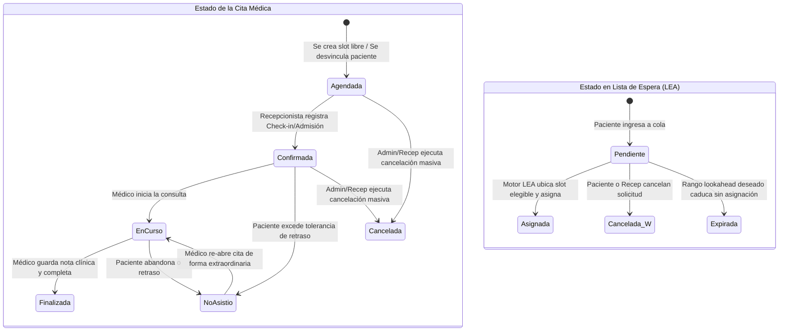
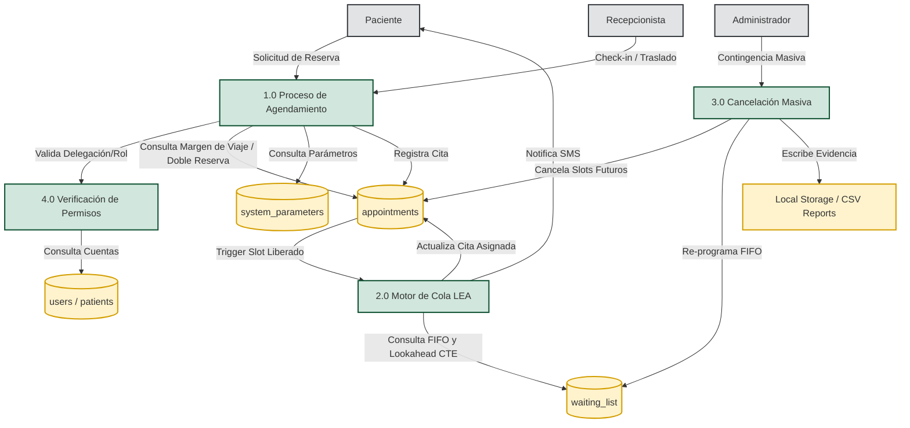
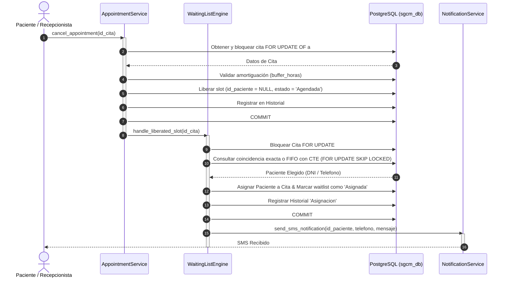
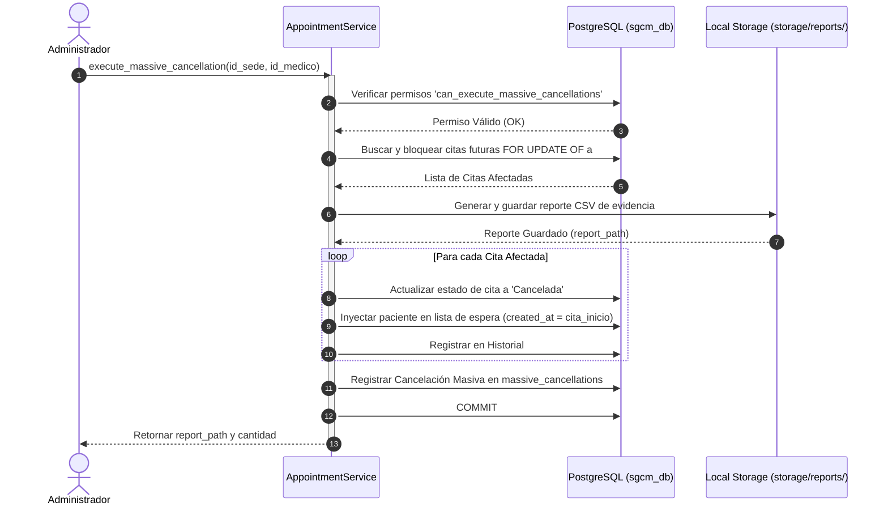

# 🧠 Capítulo 2: Lógica de Negocio y Motor de Lista de Espera (LEA)

**ID del Documento:** `DOC-02`  
**Estado:** `APPROVED`  
**Garantía de Idempotencia:** Requerido para todas las asignaciones automáticas de slots.  
**Estrategia contra Race Conditions:** Bloqueo pesimista a nivel de fila y bloqueo seguro en joins (`FOR UPDATE OF a SKIP LOCKED`).

---

## 1. Algoritmo de Lista de Espera Automática (LEA)

El motor de asignación opera de manera reactiva ante la liberación de disponibilidad médica. Su propósito es capturar de forma ordenada y consistente el primer paciente de la lista de espera elegible para ocupar el espacio vacante, aplicando restricciones dinámicas parametrizadas.

### 1.1. Reglas de Negocio Implementadas:
1.  **Prioridad FIFO:** Los pacientes en cola son atendidos por estricto orden de solicitud (`created_at ASC`).
2.  **Sede Específica:** Las solicitudes de lista de espera están vinculadas a una sede física específica (`wl.id_sede = a.id_sede`).
3.  **Regla de Amortiguación Dinámica (Buffer Horas):** Parametrizada dinámicamente mediante `buffer_horas` en la tabla `system_parameters`. Si un espacio se libera para el **día de hoy**, solo se asignará automáticamente si existe una diferencia de **al menos `buffer_horas`** entre la hora actual UTC y el inicio de la cita. Esto previene asignar citas a las que el paciente físicamente no alcanzará a asistir.
4.  **Regla de los Días Siguientes (Lookahead Limitado):** Si no hay un paciente con un rango de fechas que cubra exactamente el slot liberado, se permite asignar el espacio a un paciente de rango específico (`RangoEspecifico`) si la cita liberada cae en los **días posteriores** a su rango, con un **límite configurable de `lookahead_dias` posteriores** (ej. 7 días).
5.  **Asignación Directa:** La cita se asigna de manera directa a la cuenta del paciente. El sistema no requiere confirmación previa de 15 minutos (reduciendo la barrera digital para adultos mayores). La persona simplemente recibe la notificación y tiene la opción de cancelarla libremente desde su portal si no le resulta conveniente.

### 1.2. Prioridad de Coincidencia Exacta en Cancelación Masiva:
*   Si se crea un nuevo slot de disponibilidad con otro médico en la **misma fecha y hora original del paciente afectado por una cancelación masiva**, el motor LEA prioriza de forma absoluta a dicho paciente (coincidencia exacta) antes de evaluar el resto de la cola FIFO general del sistema.

---

## 2. Modelos Visuales: Estados y Flujos de Datos

### 2.1. Diagrama de Estados de la Cita Médica y Lista de Espera
El ciclo de vida de los registros en PostgreSQL cambia de forma atómica ante intervenciones de los usuarios y disparadores automáticos del motor LEA:



### 2.2. Diagrama de Flujo de Datos (DFD Nivel 1)
Representación de cómo fluyen los datos clínicos y las configuraciones de control de accesos a través de los almacenes físicos y procesos lógicos del sistema:



---

## 3. Implementación de Consulta y Bloqueo Concurrente (SQL CTE)

Para mitigar las condiciones de carrera (*Race Conditions*) en las que múltiples workers asíncronos concurrentes intenten tomar el mismo slot libre, utilizaremos la sintaxis **`FOR UPDATE OF a SKIP LOCKED`** y una **Expresión de Tabla Común (CTE)** en PostgreSQL que consulta los parámetros en caliente una sola vez por transacción.

```sql
-- CTE para leer parámetros en caliente y seleccionar paciente
WITH params AS (
    SELECT 
        (SELECT param_value::int FROM system_parameters WHERE param_key = 'lookahead_dias') AS look_d
)
SELECT wl.id_espera, wl.id_paciente, wl.tipo_cola, wl.rango_deseado, p.telefono, p.nombre_completo as paciente_nombre
FROM waiting_list wl
JOIN patients p ON wl.id_paciente = p.id_paciente
CROSS JOIN params
WHERE wl.estado = 'Pendiente'
  AND wl.id_especialidad = :id_especialidad
  AND wl.id_sede = :id_sede
  AND (
      wl.tipo_cola = 'FechaCercana'
      OR (
          wl.tipo_cola = 'RangoEspecifico'
          AND wl.rango_deseado @> :fecha_cita::date
      )
      OR (
          wl.tipo_cola = 'RangoEspecifico'
          AND :fecha_cita::date > upper(wl.rango_deseado)
          AND :fecha_cita::date <= upper(wl.rango_deseado) + params.look_d
      )
  )
ORDER BY wl.created_at ASC
LIMIT 1
FOR UPDATE SKIP LOCKED;
```

---

## 4. Lógica del Backend en Python (Capa de Servicio)

El backend en Python/psycopg2 implementa la validación transaccional complementaria y la regla de las 2 horas de amortiguación dinámica utilizando cursores seguros y control estricto de transacciones manuales:

```python
class WaitingListEngine:
    @staticmethod
    def handle_liberated_slot(id_cita, realizado_por='Sistema', usuario_identificador='system_engine@clinicasalud.com'):
        """
        Controlador central del motor LEA.
        Se activa al detectar la cancelación de una cita o la apertura de nueva disponibilidad.
        """
        conn = Database.get_connection()
        conn.autocommit = False
        cursor = conn.cursor(cursor_factory=RealDictCursor)
        try:
            # 1. Bloquear y verificar cita
            cursor.execute("SELECT ... FROM appointments WHERE id_cita = %s FOR UPDATE;", (id_cita,))
            appointment = cursor.fetchone()
            
            # 2. Validar regla de amortiguación horaria en caliente
            cursor.execute("SELECT param_value::int as buffer_horas FROM system_parameters WHERE param_key = 'buffer_horas';")
            buffer_horas = cursor.fetchone()['buffer_horas']
            
            ...
```

### 4.1. Diagrama de Secuencia: Asignación Reactiva LEA
Flujo de interacción temporal de las clases y base de datos durante la liberación de disponibilidad y asignación automática por LEA:



---

## 5. Módulo de Agendamiento, Modificación y Cancelación de Citas

El sistema cuenta con reglas robustecidas para garantizar la integridad operativa y clínica:

### 5.1. Cancelación Individual por el Paciente:
*   El paciente puede cancelar su cita libremente siempre que falten al menos **`buffer_horas`** (obtenido dinámicamente, ej: 2 horas) de anticipación.
*   Si cumple, la cita se libera (`id_paciente = NULL, estado = 'Agendada'`) y se dispara inmediatamente el evento de reasignación LEA para la cola de espera.

### 5.2. Cambio de Sede con Geografía Estricta:
*   Para evitar errores operativos, la Recepcionista o Paciente solo puede cambiar la sede física de una cita a sedes de la **misma ciudad de origen del paciente** (`patients.ciudad_origen`).
*   Si el paciente se muda de ciudad, se debe actualizar primero su perfil del paciente para poder cambiar la sede de su cita.

### 5.3. Cancelación Masiva por Contingencia y Reprogramación FIFO:
*   Los Administradores (o Recepcionistas si cuentan con delegación de permisos) pueden ejecutar cancelaciones masivas de citas futuras por contingencias operativas (ej. ausencia médica o fallas en la sede).
*   **Exportación de Reporte:** El sistema genera atómicamente un archivo CSV con la lista de pacientes y médicos afectados en el directorio local `storage/reports/` (simulador de Blob Storage).
*   **Auto-reprogramación Cronológica:** Los pacientes afectados re-ingresan automáticamente a la lista de espera con estado `Pendiente`, pero con la propiedad `created_at` fijada a la hora de inicio de su cita original cancelada. Esto asegura que conserven prioridad cronológica exacta en futuras asignaciones del motor LEA.

#### Diagrama de Secuencia de Cancelación Masiva y Rescheduling


---

## 6. Reglas Clínicas Avanzadas de Agendamiento

### 6.1. Restricción de Doble Reserva Activa y Autorizaciones Clínicas:
*   Un paciente no puede auto-agendar de forma activa más de una cita por especialidad al mismo tiempo para evitar acaparamiento.
*   **Excepción:** Si el paciente cuenta con una derivación clínica registrada en `medical_authorizations` (ej. 10 sesiones de terapia), el sistema consume una sesión y le permite programar citas adicionales concurrentes para dicha especialidad.

### 6.2. Bloqueo por Inasistencia Reiterada:
*   Si un paciente acumula una cantidad parametrizable de inasistencias consecutivas (`max_inasistencias_consecutivas`, por defecto 3 marcas de `'NoAsistio'` seguidas), su portal de auto-agendamiento se suspende automáticamente por `dias_bloqueo_inasistencia` (ej. 15 días).
*   Durante este período, el paciente solo podrá agendar citas de forma asistida a través del canal de la Recepcionista.

### 6.3. Tiempo de Traslado Inter-Sede:
*   Si un paciente programa dos citas el mismo día en sedes físicas distintas, el sistema valida que exista un margen mínimo de traslado de al menos `minutos_traslado_sedes` (por defecto 60 minutos) entre el fin de la primera cita y el inicio de la segunda para evitar cruces imposibles de cumplir.
