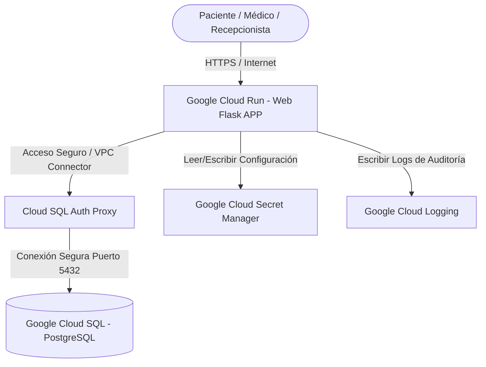

# ☁️ Capítulo 3: Mapeo de Infraestructura Cloud y Análisis de Costos

**ID del Documento:** `DOC-03`  
**Estado:** `APPROVED`  
**Límite de Costos Establecido:** `< $50 USD / mes` para el entorno de staging/demostración.

---

## 1. Mapeo General de Componentes Multicloud

Para garantizar que el **Sistema de Gestión de Citas Médicas (SGCM)** sea un producto profesional y portable para tu portafolio, definimos el mapeo de cada componente lógico de nuestra arquitectura de 3 capas sobre las nubes líderes: **Amazon Web Services (AWS)**, **Google Cloud Platform (GCP)** y **Microsoft Azure**.

| Componente del SGCM | 📦 AWS | 🟢 GCP (Recomendado) | 🔵 Azure |
| :--- | :--- | :--- | :--- |
| **Capa Presentación y Servidor Flask** | AWS ECS Fargate (Serverless Containers) | **Google Cloud Run** | Azure Container Apps |
| **Base de Datos Relacional (PostgreSQL)** | Amazon RDS for PostgreSQL | **Google Cloud SQL for PostgreSQL** | Azure Database for PostgreSQL |
| **Cola de Tareas & Cache (Workers/LEA)** | Amazon ElastiCache for Redis | **Google Cloud Memorystore for Redis** | Azure Cache for Redis |
| **Almacenamiento Estático (Docs / Logs)** | Amazon S3 | **Google Cloud Storage (GCS)** | Azure Blob Storage |
| **Mensajería y Notificaciones SMS** | Amazon SNS (Simple Notification Service) | **Google Cloud Pub/Sub** | Azure Queue Storage |
| **Gestión de Secretos (Keys / Credentials)** | AWS Secrets Manager | **Google Cloud Secret Manager** | Azure Key Vault |

---

## 2. Comparativa Detallada de PostgreSQL en Producción

Evaluamos los tres servicios administrados de PostgreSQL para un entorno de alta disponibilidad (HA) con soporte para exclusión GIST:

### 2.1. Amazon RDS for PostgreSQL (AWS)
*   **Instancia Sugerida:** `db.t4g.medium` (2 vCPUs, 4GB RAM, procesador ARM Graviton2).
*   **Configuración:** Multi-AZ (replicación síncrona en otra zona de disponibilidad para recuperación automática de fallos).
*   **Almacenamiento:** 20GB de disco SSD gp3 con IOPS configurables.
*   **Ventaja:** Excelente rendimiento, backups consistentes Point-in-Time y monitoreo ultra-detallado con Performance Insights.
*   **Costo Estimado:** `~$65.00 USD / mes` (Sin Multi-AZ) o `~$130.00 USD / mes` (Con Multi-AZ).

### 2.2. Google Cloud SQL for PostgreSQL (GCP) - ¡Seleccionado!
*   **Instancia Sugerida:** `db-custom-1-3840` (1 vCPU, 3.75GB RAM, procesador Intel/AMD).
*   **Configuración:** Alta Disponibilidad (regional failover automático).
*   **Almacenamiento:** 10GB de almacenamiento SSD persistente con auto-crecimiento configurado.
*   **Ventaja:** Configuración y administración extremadamente simplificadas. Escalado flexible e integración automática con IAM mediante el Cloud SQL Auth Proxy para máxima seguridad de red.
*   **Costo Estimado:** `~$35.00 USD / mes` (Entorno de desarrollo/demostración simple) o `~$70.00 USD / mes` (Alta disponibilidad para producción).

### 2.3. Azure Database for PostgreSQL Flexible Server (Azure)
*   **Instancia Sugerida:** `Standard_D2s_v3` (2 vCPUs, 8GB RAM).
*   **Configuración:** Alta disponibilidad en la misma zona o zona con redundancia.
*   **Almacenamiento:** 32GB de disco Premium SSD.
*   **Ventaja:** Excelente ecosistema si la clínica ya utiliza Active Directory de Microsoft.
*   **Costo Estimado:** `~$75.00 USD / mes`.

---

## 3. Análisis de Costos, Pros y Contras por Proveedor

Para un entorno **Staging/Portafolio de Demostración** en GitHub (carga baja/media), comparamos el costo global estimado de desplegar todo el sistema:

### 🟢 Opción A: Google Cloud Platform (GCP) - RECOMENDACIÓN FINAL
El stack recomendado consiste en: **Cloud Run (Flask app) + Cloud SQL PostgreSQL + Secret Manager + GCS**.

*   **Análisis de Costos Mensuales (Estimado):**
    *   *Cloud Run:* `$0.00 - $5.00 USD` (Facturación por segundo de cpu/ram activo. **Escala a 0 instancias si no hay tráfico**, eliminando costos ociosos).
    *   *Cloud SQL PostgreSQL (db-custom-1-3840, 10GB SSD):* `~$32.00 USD`.
    *   *Cloud Storage & Secret Manager:* `~$1.00 USD`.
    *   **Costo Total Estimado:** **`~$33.00 - $38.00 USD / mes`**.
*   **Pros:**
    *   **Costo inmejorable para portafolio:** La capacidad de Cloud Run de apagar los servidores si no hay pacientes navegando reduce los costos fijos casi a cero.
    *   Despliegue e integración ágil vía contenedores con Docker y Cloud Build.
    *   Panel de monitoreo integrado Cloud Logging excelente.
*   **Contras:**
    *   Cloud Run puede presentar latencia de inicio frío (cold start) si el contenedor lleva horas apagado, aunque se puede mitigar configurando 1 instancia mínima activa.

---

### 📦 Opción B: Amazon Web Services (AWS)
El stack consiste en: **AWS ECS Fargate (Flask) + AWS RDS PostgreSQL + AWS S3 + Secrets Manager**.

*   **Análisis de Costos Mensuales (Estimado):**
    *   *ECS Fargate (0.25 vCPU, 0.5GB RAM activa):* `~$15.00 USD` (No escala a cero de forma automática y nativa como Cloud Run; requiere tener al menos 1 tarea activa corriendo 24/7).
    *   *RDS for PostgreSQL (db.t4g.micro, 20GB SSD):* `~$35.00 USD`.
    *   *S3 & KMS:* `~$2.00 USD`.
    *   **Costo Total Estimado:** **`~$52.00 - $65.00 USD / mes`**.
*   **Pros:**
    *   La plataforma más consolidada y valorada en el mercado empresarial.
    *   Robustez de RDS PostgreSQL con backups y restauración automática inigualables.
*   **Contras:**
    *   Configuración compleja de red (VPC, Subnets públicas/privadas, Route Tables, Security Groups) e IAM que eleva la curva de aprendizaje del despliegue.
    *   Costo base fijo más alto por no poder apagar los servidores web a cero.

---

### 🔵 Opción C: Microsoft Azure
El stack consiste en: **Azure Container Apps + Azure Flexible PG + Blob Storage**.

*   **Análisis de Costos Mensuales (Estimado):**
    *   *Azure Container Apps:* `~$10.00 USD` (Soporta escala a cero mediante KEDA).
    *   *Azure Database for PG (Burstable B1ms):* `~$38.00 USD`.
    *   *Blob Storage:* `~$2.00 USD`.
    *   **Costo Total Estimado:** **`~$50.00 - $60.00 USD / mes`**.
*   **Pros:**
    *   Excelente suite de integraciones si la aplicación se expande a servicios corporativos de Microsoft.
    *   Container Apps es muy potente y flexible.
*   **Contras:**
    *   Costos de salida de datos (egress bandwidth) y transacciones de disco un poco más elevados y difíciles de predecir.

---

## 4. Arquitectura de Despliegue Sugerida (GCP)

Para tu portafolio, el diseño de la arquitectura física final propuesta es el siguiente:

### Configuración del Despliegue Declarativo:
Se utilizarán contenedores Docker para empaquetar la aplicación Flask. El archivo `Dockerfile` en el repositorio permitirá a **GCP Cloud Build** compilar la imagen y desplegarla automáticamente en **Cloud Run** con un solo comando o tras realizar un `git push` a la rama `main` en GitHub.
