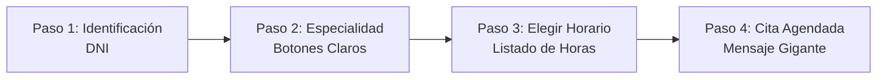

# ♿ Capítulo 4: Accesibilidad, Roles y Seguridad de Datos (WCAG 2.1 AA)

**ID del Documento:** `DOC-04`  
**Estado:** `APPROVED`  
**Clasificación de Datos:** Datos Sensibles de Salud (PHI - Protected Health Information)  
**Cumplimiento Normativo:** HIPAA (Internacional) / Ley de Protección de Datos Personales Habeas Data (Colombia).

---

## 1. Diseño de Interfaz Inclusiva para Adultos Mayores

Para cumplir con la directiva de que el sistema sea fácil de usar por personas de todas las edades (especialmente personas mayores con menor familiaridad digital o con dificultades visuales/motoras), la capa de presentación se diseñará bajo la normativa **WCAG 2.1 Nivel AA/AAA** enfocada en la **usabilidad e inclusión**.

### 1.1. Patrón de Flujo Guiado: Linear Wizard Pattern
Evitaremos el uso de tableros de control complejos con menús anidados o excesivos hipervínculos. Para agendar una cita, el sistema guiará al usuario en un flujo estrictamente lineal y secuencial:

### 1.2. Directrices Visuales y Motoras:
*   **Touch Targets Gigantes (Botones):** Todos los elementos interactivos y botones tendrán un área táctil mínima de **48x48 píxeles** con suficiente espacio de separación.
*   **Tipografía y Selector de Temas:** 
    *   Uso de fuentes legibles *sans-serif* (**Inter** para cuerpo y **Outfit** para títulos) con interlineado ampliado y soporte nativo para escalado de texto en el navegador de hasta un 200%.
    *   Tres temas visuales dinámicos: Claro Premium, Oscuro Sleek y un tema especial de **Alto Contraste** (negro puro con textos interactivos en amarillo brillante o blanco de al menos 2px de grosor, asegurando una relación de contraste superior a `7:1` para baja visión).

---

## 2. Gestión de Roles y Permisos (RBAC / ABAC)

El sistema opera bajo un control estricto de accesos y una política de segregación de funciones:

### 2.1. Matriz de Accesos y Roles del Sistema

| Acción / Permiso | Admin | Recepcionista | Médico | Paciente |
| :--- | :---: | :---: | :---: | :---: |
| **Autogestión de Perfil e ingresar con DNI** | ✅ | ✅ | ✅ | ✅ |
| **Modificar su propia Sede asignada (de cita)** | ✅ | ❌ | ❌ | ✅ |
| **Modificar Sede de Médicos o Recepcionistas** | ✅ | ❌ | ❌ | ❌ |
| **Buscar y agendar citas a Nivel Nacionial** | ✅ | ✅ | ❌ | ✅ |
| **Registrar y ver Lista de Espera local (Sede)** | ✅ | ✅ | ❌ | ✅ (Sede única) |
| **Autonomía Clínica (Iniciar/Finalizar Consulta)** | ❌ | ❌ | ✅ | ❌ |
| **Visualizar Expedientes y Notas Clínicas Confidenciales**| ❌ | ❌ (Privacidad) | ✅ | ✅ (Sólo propias) |
| **Consultar Historial de Auditoría de Citas de un paciente**| ✅ | ✅ (Sólo soporte) | ❌ | ❌ |
| **Configuración de Parámetros Globales (Buffer/Lookahead)**| ✅ | ❌\* | ❌ | ❌ |
| **Cancelación Masiva de Agenda por Contingencia** | ✅ | ✅\* | ❌ | ❌ |
| **Delegación Temporal de Permisos Operativos** | ✅ | ❌ | ❌ | ❌ |

*\*A menos que exista una entrada de delegación temporal de permisos vigente en `permissions_delegation`.*

---

## 3. Capa de Seguridad y Delegaciones Temporales (ABAC)

Para flexibilizar la operación administrativa ante contingencias y descansos, implementamos un esquema dinámico de **Delegación de Permisos Temporales**:

### 3.1. Delegaciones Dinámicas (`permissions_delegation`):
*   El Administrador puede asignar delegaciones de permisos específicas a Recepcionistas (por ejemplo, `can_execute_massive_cancellations` o `can_configure_system_parameters`).
*   Cada asignación cuenta con un rango temporal estricto (`fecha_inicio` y `fecha_expiracion`). El backend evalúa la vigencia en tiempo real en SQL (`fecha_expiracion > NOW()`), asegurando la caducidad del permiso de forma automática e inmediata sin intervención manual.

### 3.2. Cláusula de Privacidad Clínica Estricta:
*   Las Recepcionistas tienen estrictamente prohibido visualizar o modificar las notas clínicas, los diagnósticos y las notas de evolución clínica de las citas médicas. Su acceso se limita al agendamiento administrativo, check-in, inasistencias y cobros.
*   El acceso a notas clínicas está reservado de manera autónoma para el **Médico** de cabecera y el propio **Paciente** (propietario de la ficha clínica).

---

## 4. Privacidad y Seguridad de los Datos (Habeas Data / PHI)

### 4.1. Enmascaramiento de Datos (*Data Masking*) en Logs
Ninguna función del sistema escribirá datos sensibles de salud del paciente (DNI, nombre, historial clínico, teléfono, email) en los archivos de log del servidor o de auditoría pública. 
*   **Ejemplo de log seguro (Implementado):** `system - Cita id_cita [UUID] agendada para paciente id_paciente [UUID] por motor LEA.`

### 4.2. Cifrado de Información Sensible
*   **En Tránsito:** Todas las conexiones con la API del backend se realizarán obligatoriamente a través de HTTPS (TLS 1.3).
*   **Cifrado de Contraseñas:** Las credenciales de acceso de los usuarios se procesan utilizando el algoritmo robusto **PBKDF2 con hashing SHA256** y salting aleatorio de forma unificada en el script de semillado y la creación de cuentas.
