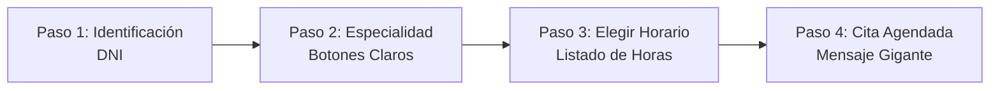

# ♿ Capítulo 4: Accesibilidad, Roles y Seguridad de Datos (WCAG 2.1 AA)

**ID del Documento:** `DOC-04`  
**Estado:** `APPROVED`  
**Clasificación de Datos:** Datos Sensibles de Salud (PHI - Protected Health Information)  
**Cumplimiento Normativo:** HIPAA (Internacional) / Ley de Protección de Datos Personales Habeas Data (Colombia).

---

## 1. Diseño de Interfaz Inclusiva para Adultos Mayores

Para cumplir con la directiva de que el sistema sea fácil de usar por personas de todas las edades (especialmente personas mayores con menor familiaridad digital o con dificultades visuales/motoras), la capa de presentación se diseñará bajo la normativa **WCAG 2.1 Nivel AA/AAA** enfocada en la **usabilidad e inclusión**.

### 1.1. Patrón de Flujo Guiado: Linear Wizard Pattern
Evitaremos el uso de tableros de control complejos con menús anidados o excesivos hipervínculos. Para agendar una cita, el sistema guiará al usuario en un flujo estrictamente lineal y secuencial:

### 1.2. Directrices Visuales y Motoras:
*   **Touch Targets Gigantes (Botones):** Todos los elementos interactivos y botones tendrán un área táctil mínima de **48x48 píxeles** (recomedado 60x60px en móvil) con suficiente espacio de separación. Esto facilita el clic a personas con temblores en las manos o dificultades motoras.
*   **Tipografía y Contraste:** 
    *   Uso de fuentes legibles *sans-serif* (ej: Outfit o Inter) con interlineado ampliado y soporte nativo para escalado de texto en el navegador sin romper el diseño.
    *   Paleta de colores de alto contraste nativo (contraste mínimo de **7:1** para texto y botones importantes).
*   **Feedback Inmediato:** Confirmaciones sonoras y alertas visuales muy descriptivas ante éxitos o errores (ej. *"Cita guardada correctamente"* en verde grande, en lugar de un pop-up genérico).

### 1.3. Comandos de Voz con Mejora Progresiva (Progressive Enhancement):
*   El sistema integrará comandos de voz opcionales mediante la **Web Speech API** nativa de JavaScript.
*   Un usuario podrá dictar su número de DNI o decir palabras sencillas como *"Siguiente"* o *"Cancelar"*.
*   **La aplicación será 100% funcional y operable sin comandos de voz.** Si el navegador del usuario no es compatible, no está bajo una conexión segura (HTTPS), o el usuario bloquea el acceso al micrófono, el sistema mostrará un fallback visual automático indicando que la función de voz está deshabilitada y podrá continuar con el teclado y mouse normalmente.

---

## 2. Gestión de Roles y Permisos (RBAC)

Para garantizar la seguridad de la información y la usabilidad, el sistema se estructurará bajo un esquema de **Control de Acceso Basado en Roles (RBAC)** con cuatro perfiles distintos:

| Rol de Usuario | Módulos y Permisos de Acceso | Enfoque de la Interfaz |
| :--- | :--- | :--- |
| **Paciente** | *   Autogestión de citas (Agendar, Cancelar, Ver Historial). *   Ingreso a lista de espera. | Interfaz ultra-simplificada (Linear Wizard). Sin barras laterales complejas. |
| **Médico** | *   Visualización de su agenda diaria/semanal en formato calendario. *   Configuración de sus bloques de indisponibilidad (vacaciones). *   Registro de finalización de atención de citas. | Dashboard optimizado enfocado en productividad. Vista rápida de su próxima consulta. |
| **Recepcionista** | *   Búsqueda y registro rápido de pacientes. *   Agendamiento de citas en nombre del paciente (llamadas o presencial). *   Gestión del check-in (llegada al consultorio) y visualización de la lista de espera (LEA). | Panel de control ágil con atajos de teclado y buscador global predictivo. |
| **Administrador** | *   Parametrización de médicos, especialidades y duración por defecto de citas. *   Consulta de logs de auditoría inmutables. *   Gestión de roles y cuentas de usuarios. | Interfaz administrativa robusta, paneles de control y auditoría. |

---

## 3. Privacidad y Seguridad de los Datos (Habeas Data / PHI)

Al tratar con datos sensibles de salud (clasificados como información personal sensible bajo Habeas Data e HIPAA), se aplicarán los siguientes controles estrictos de seguridad de datos a nivel de backend:

### 3.1. Enmascaramiento de Datos (*Data Masking*) en Logs
Ninguna función del sistema escribirá datos sensibles de salud del paciente (DNI, nombre, historial clínico, teléfono, email) en los archivos de log del servidor o de auditoría pública. 
*   **Ejemplo de log inseguro:** `system - Cita agendada para Juan Pérez con DNI 123456.`
*   **Ejemplo de log seguro (Implementado):** `system - Cita id_cita [UUID] agendada para paciente id_paciente [UUID] por motor LEA.`

### 3.2. Cifrado de Información Sensible
*   **En Tránsito:** Todas las conexiones con la API del backend se realizarán obligatoriamente a través del protocolo seguro **HTTPS (TLS 1.3)**.
*   **En Reposo:** Los campos críticos de identificación (`dni`, `telefono`, `email`) se almacenarán cifrados en la base de datos PostgreSQL utilizando funciones de encriptación simétrica (`pgcrypto`) o se protegerán mediante encriptación nativa en los discos del volumen persistente Cloud SQL.
*   **Cifrado de Contraseñas:** Las credenciales de acceso de los usuarios se procesarán utilizando el algoritmo robusto **bcrypt** con un factor de costo mínimo de 12, impidiendo brechas de seguridad por ataques de diccionario.
