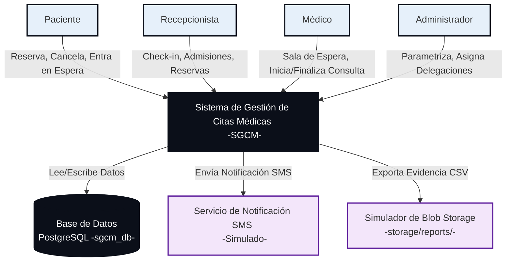

# 📁 Documentación Técnica del Sistema de Gestión de Citas Médicas (SGCM)

Bienvenido a la documentación técnica oficial del **Sistema de Gestión de Citas Médicas (SGCM)**. Este documento actúa como el índice central (Índice Maestro) que conecta cada uno de los capítulos estructurados para el diseño, desarrollo, despliegue y control de calidad del sistema.

Este diseño y especificación técnica han sido elaborados y refinados siguiendo los más estrictos estándares de la ingeniería de software y análisis de requerimientos, garantizando el cumplimiento de las directrices metodológicas de la cátedra de Diseño de Sistemas de Información, estructurando un producto robusto listo para un portafolio en producción.

---

## 🌐 Diagrama de Contexto del Sistema (C4 Nivel 1)

El siguiente modelo de contexto representa los límites del sistema SGCM, los actores o roles involucrados que interactúan con el backend de citas, y los sistemas o almacenes de datos externos vinculados:

---

## 🗺️ Índice de Contenidos Modulares

Para evitar la saturación del contexto y permitir un trabajo a profundidad en cada área, la documentación ha sido dividida en los siguientes capítulos independientes:

### 🗄️ [Capítulo 1: Diseño de Base de Datos (PostgreSQL Nativo)](01-Database-Design.md)
*   Esquema lógico-relacional normalizado.
*   Uso de tipos avanzados (`tstzrange` y `daterange` con la extensión `btree_gist`).
*   Restricción de exclusión física para evitar solapamientos a nivel de motor.
*   Configuración de `autovacuum` e índices GIST de intervalos temporales para optimizar la performance.

### 🧠 [Capítulo 2: Lógica de Negocio y Motor de Lista de Espera](02-Business-Logic.md)
*   Algoritmo detallado de asignación automática de citas (FIFO priorizado) y coincidencia exacta.
*   Mitigación de Race Conditions mediante bloqueo seguro (`FOR UPDATE OF a SKIP LOCKED`).
*   Diagramas de flujos de datos (DFD), diagramas de estado de la cita y diagramas de secuencia transaccional.
*   Reglas clínicas avanzadas: amortiguación dinámica, geografía estricta, inasistencia, doble reserva y traslado inter-sede.

### ☁️ [Capítulo 3: Mapeo de Infraestructura Cloud y Análisis de Costos](03-Infrastructure.md)
*   Mapeo de componentes en las 3 nubes líderes: **AWS vs. GCP vs. Azure**.
*   Deep dive de performance y capacidades de base de datos PostgreSQL.
*   Análisis comparativo de costos mensuales, pros/contras de cada proveedor.
*   Recomendación final y justificación técnica del stack **GCP Serverless** (Cloud Run + Cloud SQL).

### ♿ [Capítulo 4: Accesibilidad, Roles y Seguridad de Datos (WCAG 2.1 AA)](04-Security-Compliance.md)
*   Lineamientos de inclusión y UX para personas de avanzada edad.
*   Estrategia de **Linear Wizard Pattern** para flujos secuenciales y botones gigantes (48x48dp).
*   Control de Acceso Basado en Roles (RBAC): perfiles de Paciente, Médico, Recepcionista y Admin con delegación temporal dinámica.
*   Privacidad de datos médicos (Habeas Data / HIPAA) y enmascaramiento en logs.

### 🧪 [Capítulo 5: Estrategia de Aseguramiento de Calidad (QA & Testing)](05-Testing-QA.md)
*   Pirámide de pruebas automatizadas en Pytest interactuando con PostgreSQL real de pruebas.
*   Estrategia de testing de concurrencia y pruebas de integración para race conditions y reglas clínicas.
*   Herramientas de auditoría automatizada de accesibilidad (`axe-core`).

### 📦 [Capítulo 6: Gobierno de Código, Git Workflow y Operaciones](06-Operations.md)
*   Flujo de ramas estructurado basado en **GitFlow** (`main`, `develop`, `feature/*`, `release/*`, `hotfix/*`).
*   Estándar de confirmación de cambios **Conventional Commits**.
*   Versionamiento semántico (**SemVer v1.0.0**).
*   Operaciones de soporte (Estrategia de Backups y Recovery Point Objective).

---

## 🛠️ Tecnologías Core del Sistema

| Capa | Tecnología Seleccionada | Justificación |
| :--- | :--- | :--- |
| **Frontend** | HTML5 / Vanilla CSS / Vanilla JS | Carga ultra-rápida, accesibilidad óptima sin dependencias pesadas que rompan compatibilidad. |
| **Backend** | Python / Flask | Arquitectura de 3 capas ágil, madura y compatible con la suite de testing en Pytest. |
| **Base de Datos** | PostgreSQL (v15+) | Manejo de concurrencia MVCC, rangos de fecha nativos e integridad atómica a nivel de datos. |
| **Workers / Cache** | Celery / Redis | Cola de tareas ligera para procesar la lista de espera y el envío de SMS simulados de forma asíncrona. |

---
**Documento Central de Arquitectura**  
*Estado:* **APROBADO PARA DESARROLLO** (SGCM-001)  
*Versión:* `1.1.0`  
*Última Actualización:* Conforme a la Fase 3 y 4 de lógica clínica y relacional.
